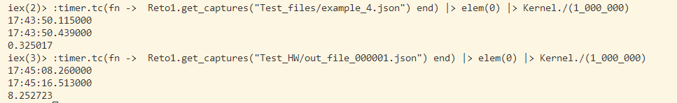

# Actividad Integradora 3.4 - Resaltador de sintaxis
## Correr el Programa

Para correr el programa, se debe estar en la consola de Elixir. Se entra con el comando iex.
Además, se debe tener el programa cargado. Usamos el flag Reto1.exs para eso

```
iex Reto1.exs
```

Una vez dentro, el programa se corre con la siguiente función. Recuerden cambiar el "input_file_here"
al archivo que quieran hacer input.

```
Reto1.get_captures("input_file_here")
```
### Ejemplo
```
Reto1.get_captures("Test_files/example_4.json")
```
Será subido a un archivo con el mismo nombre, en el mismo folder que el archivo original, pero con terminación .html en lugar de .json

## Reflexión
Este programa todavía tiene mejoras. En primera, corre en O(n*m<sup>2</sup>), pues corre línea por línea,
pasando por una función recursiva que afecta la longitud de cada línea, y cada línea corre por un Regex, que funciona de manera lineal. 
Aunque en archivos relativamente pequeños con líneas de texto cortas no afecta mucho, en archivos más grandes podría empezar a tener problemas más obvios.

Un ejemplo: corriendo el archivo example_4.json de Test_files tarda 0.32 segundos, aunque tenga muchas líneas. 
Sin embargo, out_file_000001.json de Test_HW, que tiene menos líneas pero son más largas, tarda 8.25 segundos.

.

Una segunda mejora sería abrirlo a más lenguajes posibles. Hasta ahora sólo corre en JSONS, pero sería buena idea que, dependiendo de la terminación dada al archivo, 
pueda hacer un parser diferente. 

Inicialmente tenía problemas corriendo archivos, pues desacomodaba los valores y salían en desorden. Ahora, logra identificar en el orden correcto los valores, 
y los coloca apropiadamente.
Lograr que los archivos sean apropiadamente representativos de lo que están demostrando es muy importante. Si la expresión regular tiene algún problema, o están ordenadas 
de manera incorrecta, podrían capturar cosas no deseadas. Imagínense si se debe programar una expresión regular para identificar diferentes secciones en un archivo de 
impuestos para una empresa o para uso personal. No sería buena idea que las expresiones regulares agarren números extra o menos números de los que debería agarrar.
