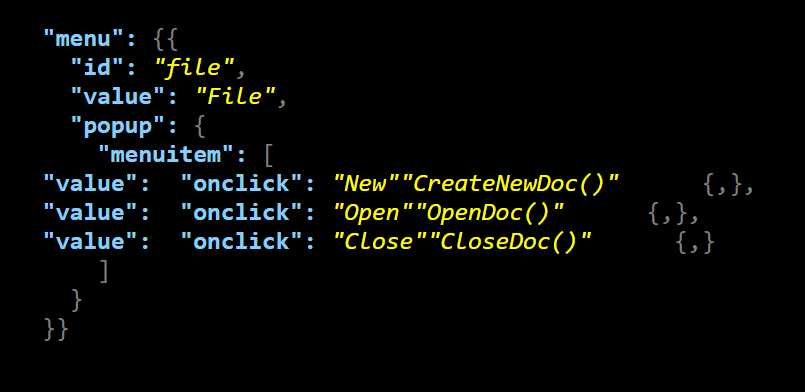
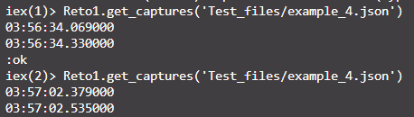

# Actividad Integradora 3.4 - Resaltador de sintaxis
## Correr el Programa

Para correr el programa, se debe estar en la consola de Elixir. Se entra con el comando iex.
Además, se debe tener el programa cargado. Usamos el flag Reto1.exs para eso

```
iex Reto1.exs
```

Una vez dentro, el programa se corre con la siguiente función. Recuerden cambiar el 'input_file_here'
al archivo que quieran hacer input.

```
Reto1.get_captures(input_file_here)
```
### Ejemplo
```
Reto1.get_captures('Test_files/example_4.json')
```
Siempre será subido al archivo output.html

## Reflexión
Este programa todavía tiene muchas mejoras. En primera, corre en un lamentable O(n<sup>3</sup>), pues corre línea por línea,
pasando por una función recursiva, y cada línea corre por un Regex, que funciona de manera lineal. Aunque en archivos relativamente
pequeños no afecta mucho, en archivos más grandes podría empezar a tener problemas más obvios.

Además, el programa no es perfecto. En el caso donde más de un valor se repita por línea, los valores tienen un orden de prioridad
y, por ende, serán agregados de manera incorrecta. Aunque en la mayoría de los casos no afecta, pues no hay múltiples llaves o 
puntuaciones por líneas, en los casos donde sí, va a fallar.
.


Si corro el programa usando example_4.json, se tarda aproximadamente 216 milisegundos. Para un archivo que corre en O(n<sup>3</sup>) no está
tan mal. Sin embargo, esto es un archivo pequeño. Mientras más crezca el archivo, el tiempo se agrandará.
.

En futuras versiones, se tendrá que encontrar la manera de resolver el problema principal del orden de prioridades. No puede ser que un programa
dedicado a resaltar la sintáxis de archivos JSON se comporte de esta manera. En el mundo real, si se implementara de esta manera terminaríamos en
la calle por malas prácticas y programación pobre. Las empresas necesitan estar constantemente buscando solucionar sus problemas, y cada vez usan
más las expresiones regulares. Por ejemplo, buscando ciertos archivos en un documento de facturas, asientos en boletos de cine, e incluso en los
editores de texto, pues ellos también resaltan de manera correcta las diferentes funciones. Mucha gente basa sus críticas de programación en que el
código sea legible. Si el resaltador de sintaxis de un Entorno Interactivo de Desarrollo no funcionara, la gente no lo utilizaría. 

Además, otra cosa que la gente busca en algoritmos es que sean eficientes. Tener que usar una función recursiva casi por definición lo hace ineficiente,
sin embargo hay que buscar la manera que sea lo más eficiente posible. 